# data-structure-6
## 8 查找  
明确几个概念：关键字（键值）主关键字（可以唯一地标识一个记录或数据元素）次关键字（能够识别多个数据元素或记录）  
查找表分为两类：静态查找表（只做查找操作）、动态查找表（查找，插入，删除操作）  
### 8.1 顺序表查找  
顺序表查找（线性查找）——最土的一种方法，从头找到尾，可以通过设置哨兵稍微提高一点  
### 8.2 有序表查找  
有序查找的前提就是先做有序排列  
#### 折半查找（二分查找） 
每次取中间  
#### 插值查找  
```
mid = low + (high-low) * (key-a[low]) / (a[high]-a[low])
```
#### 斐波那契查找  
未完待续  
### 8.3 线性索引查找  
* 稠密索引
索引就是把一个关键字与它对应的记录相关联，例如家中的物品是无序的，但是把家中所有物品的位置都记录在一个小本子上，这样寻找起来也非常容易，这个小本子就是索引  
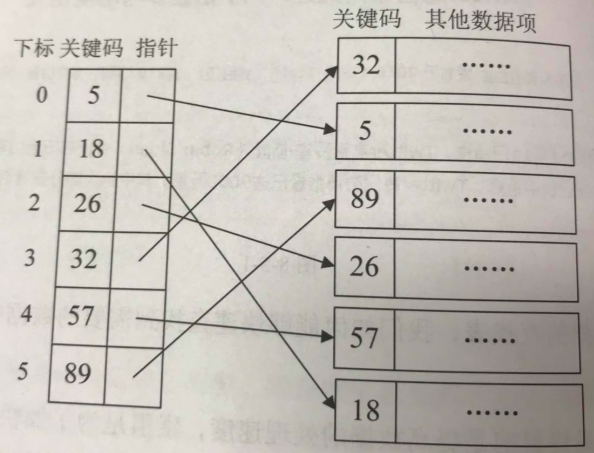  
对于稠密索引，索引项是按照关键码有序排列的，我们在查找关键字时，可以用到折半、插值、斐波那契等有序查找算法。  
* 分块索引  
举个例子，图书馆的藏书就用到了分块的重要思想，为了减少索引项的数量，我们对数据集进行分块，使其分块有序，再对每一块建立一个索引项  
需要满足两个条件：块内无序，块间有序  
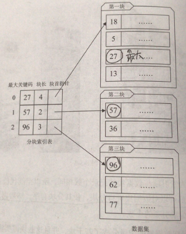  
如图所示，索引项结构包括三部分：最大关键码（每一块内的最大关键字都比下一块的最小关键字还要小）、块中记录的个数、指向块首数据元素的指针  
* 倒排索引  
举个例子，搜索引擎  
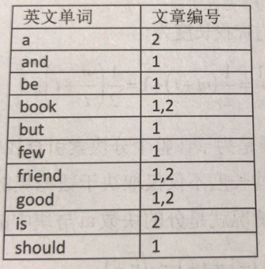  
索引项包括两部分：次关键码（图中的英文单词）、记录号表（图中的文章标号）  
### 8.4 二叉排序树  
普通的顺序存储（无序）的插入、删除操作效率可以接受，但是查找效率很低；  
有序线性表在插入和删除操作上效率高，但是查找效率很低；  
有没有一种插入删除效率不错，查找效率也高的呢？那就是二叉排序树  
例：现在对集合【62，88，58，47，35，73，51，99，37，93】做查找，从第一个元素62开始创建二叉树，如图所示  
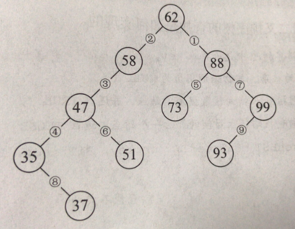   
当我们对得到的这颗二叉树进行中序遍历的时候，就可以得到一个有序的序列【35，37，47，51，58，62，73，88，93，99】  
二叉排序树的性质：  
1若它的左子树不空，则左子树上所有结点的值都小于根结点的值  
2若它的右子树不空，则右子树上所有结点的值都小于根结点的值  
3它的左右子树也分别为二叉排序树  
二叉排序树的几种操作：查找、插入、删除  
* 查找：  
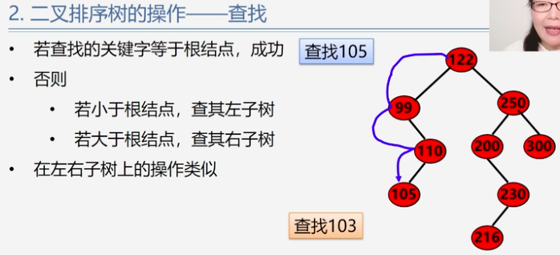   
```
BSTree SearchBST(BSTree T,KeyType key)
  {
    if((!T)||key==T->data.key)
      return T;
    else if(key<T->data.key)
      return SearchBST(T->lchild,key);//在左子树中继续查找
    else return SearchBST(T->rchild,key);//在右子树中继续查找
  }
```
在二叉排序树上进行查找一共比较了多少次（查找长度）？等于该结点所在的层数  
最多比较的次数=树的深度  
平均查找长度ASL=(每个结点的查找长度之和)/结点数  
* 插入：
原则就是比根结点小的找左边，大的找右边  
序列元素顺序不同，生成的二叉排序树形态也不同，如图  
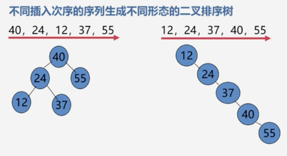   
* 删除：请神容易送神难  
分几种情况：
1 被删除的是叶子结点：直接删掉  
2 被删除的结点只有左子树或者右子树，直接用它的孩子替换就行了-子承父业  
3 被删除的结点既有左子树又有右子树，用它的前驱或后继替换（前驱就是左子树的最大值、后继是右子树的最小值）  
### 8.5 平衡二叉树（AVL树）  
定义：AVL树首先要是一棵二叉排序树，其次要满足两个条件：左子树与右子树的高度差绝对值小于等于1；左子树和右子树也是平衡二叉树。  
平衡因子（BF）=结点左子树高度-结点右子树高度  
根据定义，每个结点的平衡因子只能是-1，0，1  
平衡二叉树按照二叉排序树插入元素的原则进行插入操作，容易导致失衡，需要进行平衡调整，平衡调整原则有二：（1）减低层次（2）保持二叉排序树性质  
例题：  
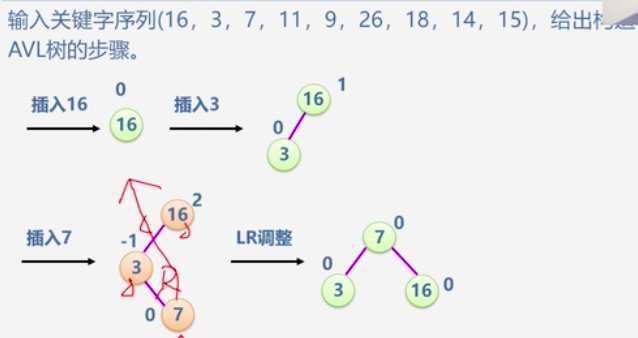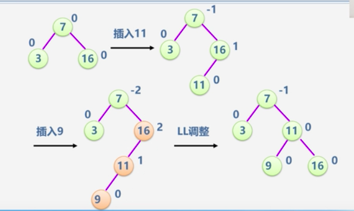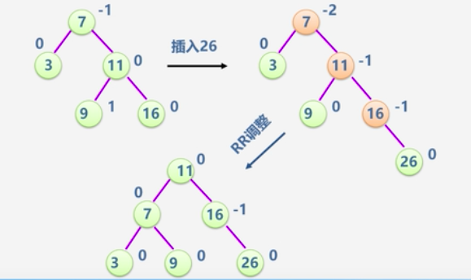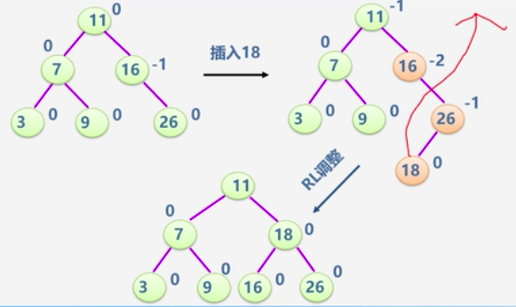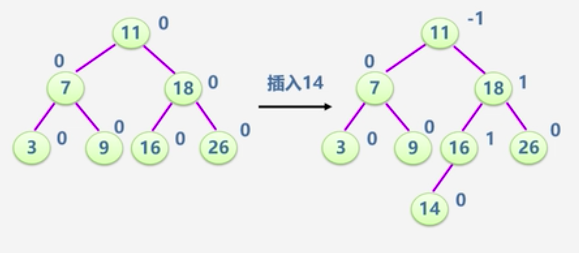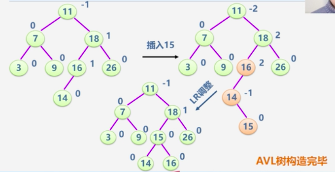 
### 8.6 哈希表（散列表）  
相关术语：散列方法（杂凑法），散列函数（杂凑函数），散列表（杂凑表）、冲突  
在散列表中，冲突是不可避免的，只能尽量减少，怎样减少？要解决两个问题  
1 构造好的散列函数（函数尽可能简单，对应地址分布均匀，减少浪费）  
2 制定一个好的解决冲突的方案  
* 散列函数的构造方法：直接定址法，除留余法（常用较优）  
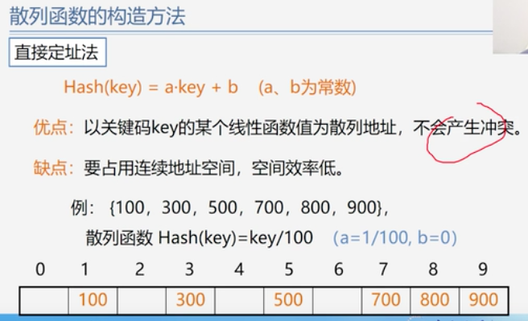 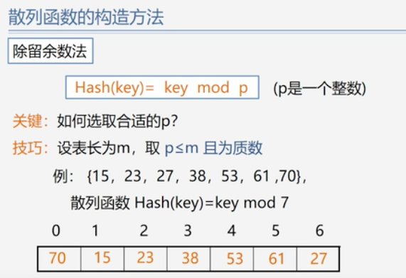   
处理冲突的方法：开放定址法，(链地址法)拉链法（较优）  
开放定址法：有冲突就去寻找下一个空的散列地址，如线性探测法、二次探测法  
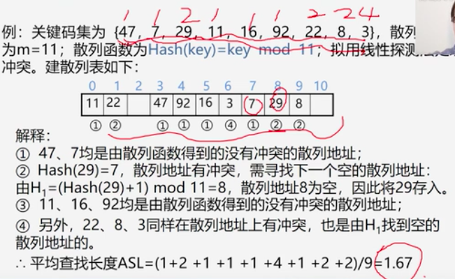  
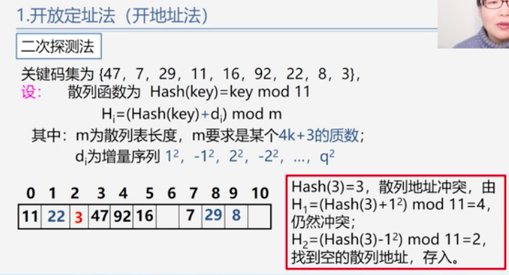  
链地址法：相同散列地址的记录链成一单链表  
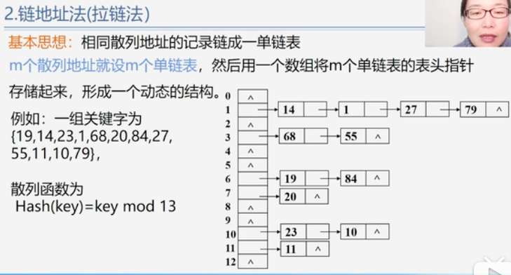  
* 散列表的查找  
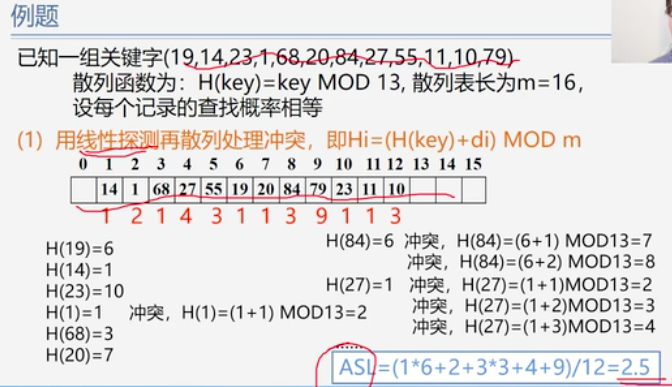  
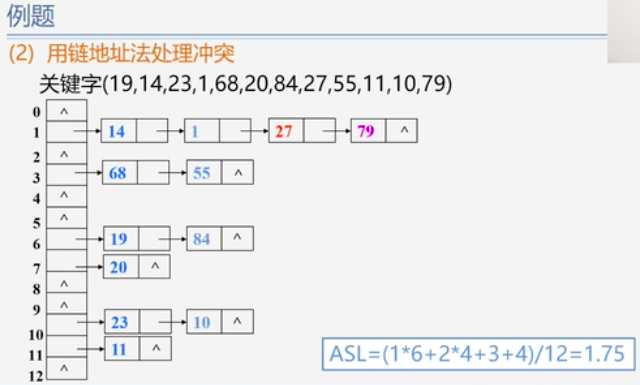  
装填因子=表中填入的记录数/哈希表长度  
